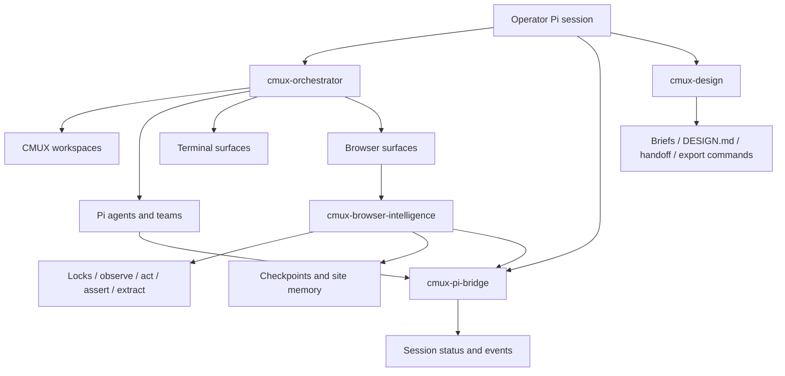
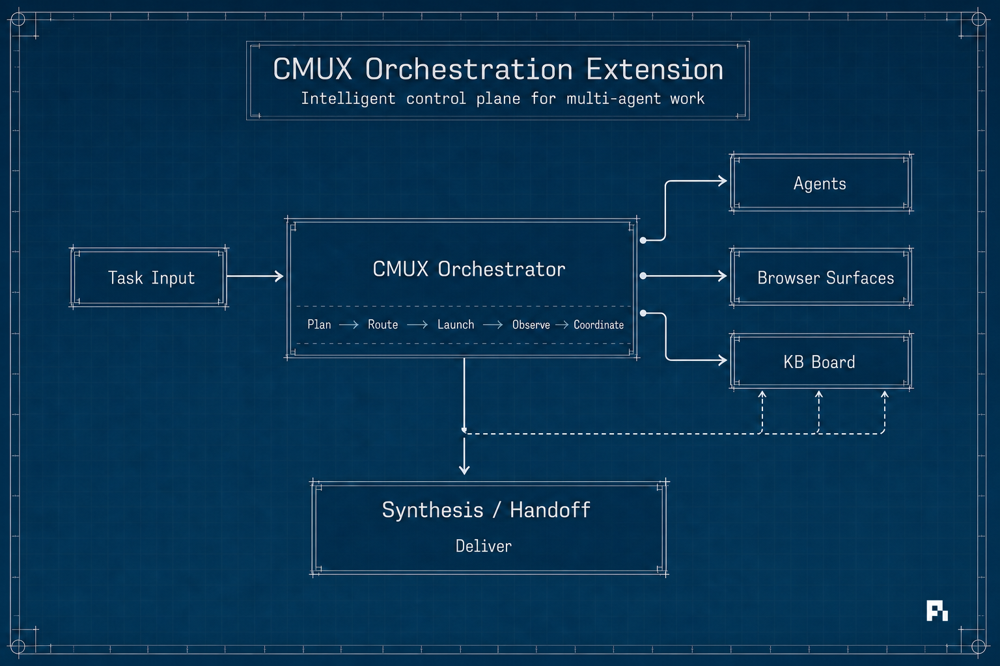
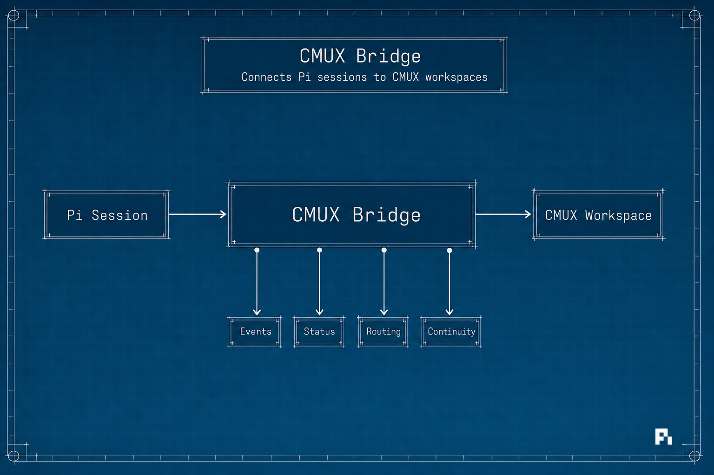
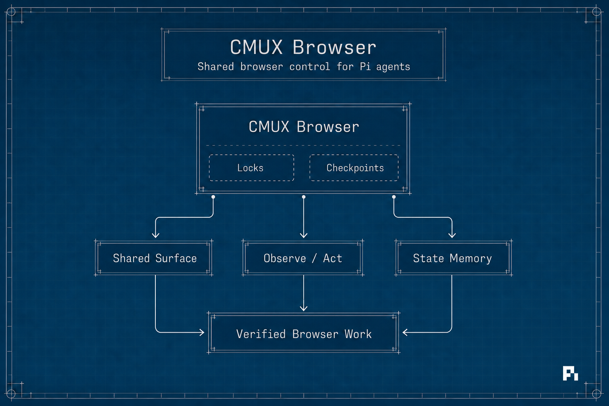
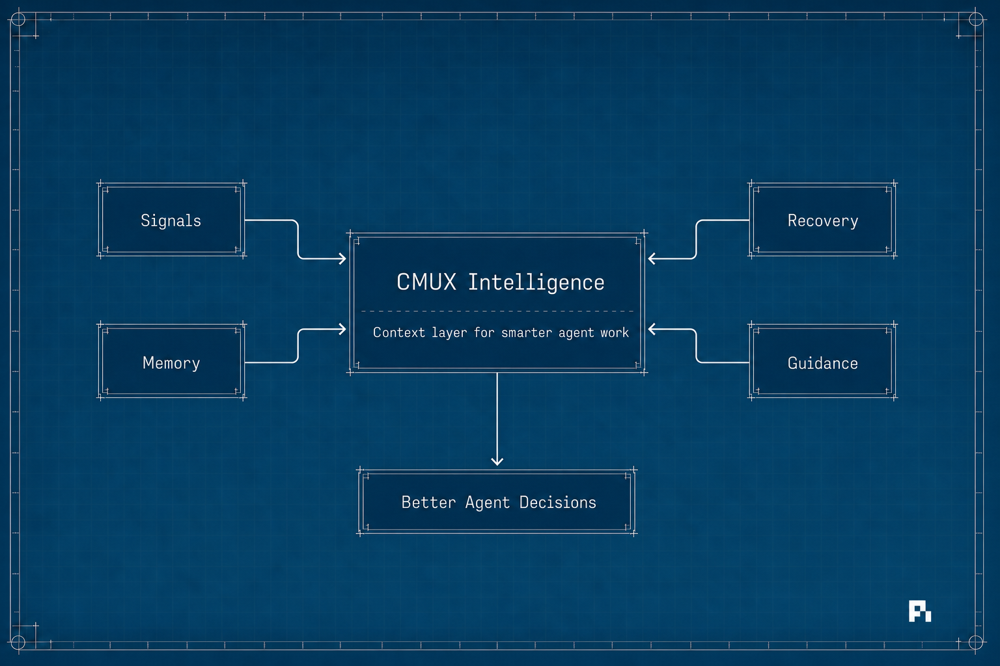
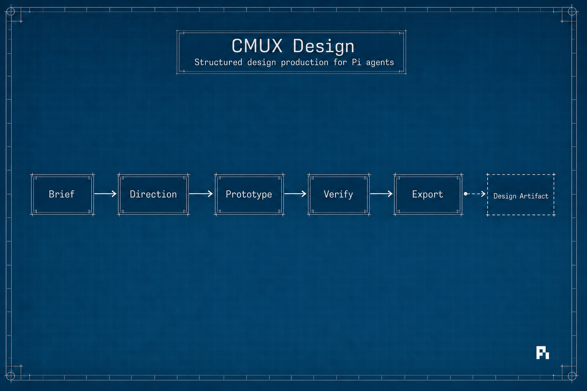

# Pi CMUX — Extension Family for Local Multi-Agent Workflows


> A coordinated family of Pi extensions for running local CMUX-powered multi-agent workflows: orchestration, Pi session bridging, browser intelligence, and design execution.

[Pi](https://pi.dev/) is intentionally small and extensible. [cmux](https://github.com/dnakov/cmux) gives agents a local workspace made of terminal and browser surfaces. This package connects the two so a Pi session can create teams, coordinate agents, operate browser surfaces safely, preserve handoffs, and run repeatable design workflows.

This repository is packaged as **one Pi package** because the extensions are designed to work together:

| Extension | Role | Primary value |
| --- | --- | --- |
| `cmux-orchestrator.ts` | CMUX control plane | Create workspaces/surfaces, launch Pi agents, coordinate teams, gather progress, run orchestration loops. |
| `cmux-pi-bridge.ts` | Session/event bridge | Link Pi sessions to CMUX workspaces, surfaces, agents, teams, tasks, and structured status/event records. |
| `cmux-browser-intelligence.ts` | Browser work layer | Add semantic browser actions, locks, observations, assertions, extraction, checkpoints, recovery, and site memory. |
| `cmux-design.ts` | Design workflow layer | Plan/scaffold Huashu/Open-Design-inspired web/design artifacts and produce verified command prompts for design execution. |

## Why this exists

Modern coding agents are strongest when they can split work, see live state, hand off context, and verify outputs. The CMUX extension family turns Pi into a local multi-agent operating environment:

- **One operator, many agents** — launch solo agents or role-specialized teams from Pi.
- **Shared local surfaces** — coordinate terminal panes and browser surfaces in CMUX.
- **Structured continuity** — keep session metadata, events, status summaries, team records, run timelines, and bridge indexes.
- **Safer browser collaboration** — use locks, checkpoints, observations, assertions, memory, and recovery around shared browser work.
- **Design as a workflow** — scaffold design briefs, token systems, handoff files, browser review prompts, and export command plans.
- **Composable tools** — each extension is useful alone, but the full family gives you an end-to-end control loop.

## Repository status

This is an initial open-source release of the CMUX extension family. Expect rapid iteration around packaging, docs, compatibility, and hardening.

- Package name: `@gtwatts/pi-cmux`
- Pi package keyword: `pi-package`
- Install source: npm, GitHub, or local path
- Runtime target: Node.js 20+, Pi, cmux
- License: MIT

## Requirements

- [Pi](https://pi.dev/) installed and configured with at least one model provider.
- [cmux](https://github.com/dnakov/cmux) installed and reachable from the local shell.
- Node.js 20+.
- macOS or Linux shell environment with `bash`.
- Optional, depending on workflow:
  - `git`, `npm`, and GitHub CLI for development/publishing.
  - Local browser support through CMUX for browser-surface workflows.
  - Huashu/open-design repositories or export scripts for advanced design workflows.

> **Security note:** Pi extensions run with your local user permissions. This package can interact with CMUX sockets, browser surfaces, terminal panes, shell commands, and local files. Review source before installing and use explicit human approval for destructive, persistent, externally visible, credential-related, publishing, or deployment actions.

## Installation

### Install from npm

After the package is published to npm:

```bash
pi install npm:@gtwatts/pi-cmux
```

Try it for a single Pi run without permanently installing:

```bash
pi -e npm:@gtwatts/pi-cmux
```

### Install from GitHub

```bash
pi install git:github.com/gtwatts/pi-cmux
```

Try it for one run:

```bash
pi -e git:github.com/gtwatts/pi-cmux
```

### Local development install

From this repository root:

```bash
pi install .
# or try for one run only
pi -e .
```

From a parent directory:

```bash
pi install ./pi-cmux
pi -e ./pi-cmux
```

## Verify installation

Inside Pi, ask for a CMUX status check:

```text
Run cmux_status and summarize whether cmux is reachable.
```

Useful first checks:

```text
Run cmux_status with capabilities.
Run cmux_pi_bridge_status.
Run cmux_browser_doctor if a browser surface is open.
Run cmux_design_status if I am doing design work.
```

If tools are not visible, confirm the package is installed:

```bash
pi list
```

## Quick starts

### 1. Inspect CMUX from Pi

```text
Use cmux_status to check whether cmux is reachable. Include capabilities and the current workspace summary.
```

### 2. Launch a solo Pi agent in CMUX

```text
Use cmux_pi_agent to launch a solo agent named researcher in a split pane. Ask it to inspect this repository and summarize the extension family.
```

### 3. Launch a small team

```text
Use cmux_pi_team to create a team named docs-team with planner, writer, and reviewer roles. Goal: improve README and package docs for pi-cmux.
```

### 4. Use browser intelligence safely

```text
Bootstrap a cmux browser surface for https://pi.dev/packages, acquire a lock as operator, observe the page, extract a summary, then release the lock.
```

### 5. Scaffold a design workflow

```text
Use cmux_design_plan for a landing page redesign brief, then scaffold the design workspace into ./design-workspace.
```

## How the extensions work together



If your Markdown viewer does not support Mermaid, read the diagram as:

1. The operator talks to Pi.
2. Pi uses CMUX Orchestrator to create local workspaces, panes, browser surfaces, agents, and teams.
3. CMUX PI Bridge records session identity, status, and events.
4. CMUX Browser Intelligence makes browser work lock-aware and recoverable.
5. CMUX Design provides repeatable design planning, scaffolding, and export workflows.

## Diagram gallery

The repository includes a generated hero image and a blueprint diagram set in [`assets/`](./assets) and [`assets/diagrams/`](./assets/diagrams).

| Diagram | Preview |
| --- | --- |
| CMUX Orchestration Extension |  |
| CMUX Bridge |  |
| CMUX Browser |  |
| CMUX Intelligence |  |
| CMUX Design |  |

See [`docs/DIAGRAMS.md`](./docs/DIAGRAMS.md) for image metadata and usage notes.

## Extension details

### CMUX Orchestrator

The orchestrator is the local control plane for CMUX. It wraps common CMUX operations with schemas that are easy for Pi agents to call safely and consistently.

Primary capabilities:

- Inspect CMUX readiness and workspace/surface topology.
- Create, select, rename, reorder, move, annotate, and close workspaces.
- Create terminal/browser surfaces and panes.
- Send terminal input, read terminal output, focus panes/surfaces, and manage tabs.
- Navigate and interact with CMUX browser surfaces through low-level browser commands.
- Launch solo Pi agents into CMUX panes/surfaces/workspaces.
- Create, task, gather, steer, heal, rebalance, report, and shut down Pi teams.
- Maintain orchestrator state around agents, teams, runs, templates, scorecards, artifacts, and retention.

Tools:

| Tool | Purpose |
| --- | --- |
| `cmux_status` | Check CMUX installation/reachability, current workspace, tree, capabilities, and config snippets. |
| `cmux_workspace` | List/current/tree/create/select/rename/close/reorder/move/annotate CMUX workspaces. |
| `cmux_surface` | Inspect, read, send, split, focus, rename, move, close, and manage terminal/browser surfaces. |
| `cmux_browser` | Low-level CMUX browser navigation, DOM actions, snapshots, screenshots, tabs, state save/load. |
| `cmux_pi_agent` | Launch, message, ask, broadcast, capture, focus, interrupt, close, heal, or resume solo Pi agents. |
| `cmux_pi_team` | Create and orchestrate multi-agent teams or swarms with coordination rounds and retention policy. |
| `cmux_notify` | Send desktop/sidebar notifications into CMUX. |
| `cmux_rpc` | Call CMUX socket RPC methods directly for advanced workflows. |
| `cmux_cli` | Run arbitrary CMUX CLI commands not covered by higher-level wrappers. |

### CMUX PI Bridge

The bridge keeps Pi session metadata and CMUX execution context connected. It is useful for debugging, handoffs, task boards, and multi-agent orchestration.

Primary capabilities:

- Track Pi session identity and CMUX routing metadata.
- Record structured events such as tool calls, turn ends, bridge hints, approvals, and auxiliary workflow events.
- Maintain a root index of recent sessions.
- Inspect stale sessions, session health, and linkage drift.
- Prune old bridge state with configurable retention policy.

Tools:

| Tool | Purpose |
| --- | --- |
| `cmux_pi_bridge_status` | Show bridge paths, current session metadata, and latest status snapshot. |
| `cmux_pi_bridge_sessions` | List recent bridge sessions with health and routing identity filters. |
| `cmux_pi_bridge_events` | Show recent structured events for current or filtered sessions. |
| `cmux_pi_bridge_prune` | Preview or remove old bridge session directories. |
| `cmux_pi_bridge_policy` | Get or update automatic bridge retention policy. |
| `cmux_pi_bridge_rebuild_index` | Rebuild the bridge root index from live session status files. |
| `cmux_pi_bridge_doctor` | Audit index freshness and drift between index and status files. |

### CMUX Browser Intelligence

Browser Intelligence sits above low-level browser commands and adds an agent-friendly workflow loop:

```text
bootstrap → observe → act → assert → extract → checkpoint → learn/recover
```

Primary capabilities:

- Select or create browser surfaces.
- Acquire/release locks so only one agent drives a shared surface at a time.
- Build structured page observations: page type, headings, forms, actions, alerts, snapshots.
- Perform semantic actions with target resolution, retries, tab/popup detection, network/download awareness, and postconditions.
- Verify page postconditions.
- Extract links, buttons, forms, tables, cards, key-value data, text, or explicit fields.
- Save/restore/diff/list/delete browser checkpoints.
- Store and recall site-specific memory and reusable browser skill packs.
- Classify and recover from common browser failures.

Tools:

| Tool | Purpose |
| --- | --- |
| `cmux_browser_doctor` | Diagnose a browser surface before risky work. |
| `cmux_browser_bootstrap` | Prepare/reuse a browser surface, optionally navigate, acquire lock, recall memory, checkpoint. |
| `cmux_browser_focus_and_notify` | Bring a shared browser surface to front with optional lock check and notification. |
| `cmux_browser_mechanic` | Guide/inspect/recover hard browser mechanics: dialogs, uploads, downloads, iframes, shadow DOM. |
| `cmux_browser_observe` | Build a structured page model with optional interactive snapshot. |
| `cmux_browser_act` | Robust semantic browser actions with retries and verification. |
| `cmux_browser_assert` | Verify selectors, text, URL/title/load state, and absence of blockers. |
| `cmux_browser_extract` | Extract structured data from the page. |
| `cmux_browser_lock` | Coordinate browser-surface ownership across agents/teams. |
| `cmux_browser_memory` | Store/recall/forget site-specific browser knowledge. |
| `cmux_browser_learn` | Promote successful browser knowledge into durable memory/skill packs. |
| `cmux_browser_skill_pack` | List, inspect, publish, suggest, or delete reusable browser skill packs. |
| `cmux_browser_recover` | Attempt modal/wait/reload/back/checkpoint recovery strategies. |
| `cmux_browser_run_task` | Run a high-level observe/act/assert/extract/checkpoint workflow. |
| `cmux_browser_session` | Checkpoint, restore, diff, hand off, list, rename, move, or delete browser state. |
| `cmux_browser_checkpoint_policy` | Get, set, or prune checkpoint retention policy. |

### CMUX Design

CMUX Design provides deterministic design workflow scaffolding, inspired by Huashu Design and Open Design style practices. It is intended to reduce generic UI output by forcing context, facts, direction choices, token discipline, critique, and verification.

Primary capabilities:

- Check local design repo/toolchain readiness.
- Digest local Huashu Design or Open Design references.
- Generate deterministic visual direction packs with tokens and posture rules.
- Create execution plans, clarifying questions, acceptance criteria, and reference checklists.
- Scaffold a design workspace with brief, brand spec, product facts, design directions, tweak files, handoff docs, and optional starter HTML.
- Build verified command strings for HTML verification, video rendering, GIF conversion, music, and deck export workflows.
- Generate operator-ready prompts for solo agents or CMUX teams.

Tools:

| Tool | Purpose |
| --- | --- |
| `cmux_design_status` | Check Huashu Design repo, CMUX-design artifacts, and verification/export toolchain readiness. |
| `cmux_design_repo_digest` | Inspect a local Huashu Design repo for matching references, assets, demos, and scripts. |
| `cmux_design_open_design_digest` | Inspect a local Open Design repo for reusable modes, skills, prompts, and design systems. |
| `cmux_design_direction_pack` | Return deterministic visual directions with CSS tokens and posture rules. |
| `cmux_design_plan` | Create a design execution plan with questions, acceptance criteria, and references. |
| `cmux_design_scaffold` | Create a design workspace with brief, docs, tweaks, directions, and optional HTML starter. |
| `cmux_design_build_command` | Construct verified Huashu Design verification/export commands. |
| `cmux_design_prompt` | Generate an operator-ready prompt for solo or team design execution. |

## Common workflows

### Workflow: create a disposable research team

```text
Create a CMUX Pi team named research-scouts with planner, researcher, and reviewer roles. Goal: map the public Pi package ecosystem and identify what makes a good package README. Run two coordination rounds and keep the team live.
```

### Workflow: hand off a browser task between agents

```text
Bootstrap a browser surface for the target site and acquire a lock as agent-a. Observe the page and save a checkpoint named initial. Release the lock with a handoff note for agent-b.
```

### Workflow: verify a frontend change in a shared browser

```text
Use cmux_browser_bootstrap to open the local dev server. Observe the page. Click through the main nav. Assert the expected heading and absence of console-visible blocker text. Save a checkpoint called post-ui-review.
```

### Workflow: run a CMUX design pass

```text
Use cmux_design_plan for the landing page goal. Scaffold ./design-pass. Launch a three-agent team with strategist, designer, and verifier roles. Ask the verifier to use browser intelligence checkpoints for review.
```

## State, storage, and privacy

The extensions store runtime state under the Pi agent directory by default, typically `~/.pi/agent/`:

| State area | Typical path | Contents |
| --- | --- | --- |
| Orchestrator | `~/.pi/agent/.cmux-orchestrator/` | Agents, teams, runs, events, templates, scorecards, artifacts, retention data. |
| Pi bridge | `~/.pi/agent/.cmux-pi/` | Session status files, event logs, root index, retention policy. |
| Browser intelligence | `~/.pi/agent/.cmux-browser-intelligence/` | Locks, memory, checkpoints, browser state snapshots, skill packs. |

Do not commit these runtime directories. They may contain prompts, URLs, local paths, task details, and browser state metadata.

## Safety and approvals

The package includes tools that can read local state, drive browser pages, send terminal input, run CMUX CLI commands, and coordinate other Pi agents. Recommended operator policy:

- Treat `cmux_cli`, raw RPC calls, shell-command dispatch, publishing, deployment, credential, billing, and production actions as high risk.
- Stop before irreversible actions unless the user explicitly approves the exact action.
- Prefer dry-run commands and read-only inspections before mutation.
- Use browser locks for shared browser surfaces.
- Save checkpoints before risky browser workflows.
- Keep teams live only when you need follow-up; otherwise shut them down or save reusable templates intentionally.

See [`SECURITY.md`](./SECURITY.md) for more guidance.

## Troubleshooting

### `cmux_status` cannot find cmux

- Confirm `cmux` is installed and on `PATH`.
- Try running `cmux --help` in the same shell that launches Pi.
- Check whether CMUX socket environment variables or config paths differ between your terminal and Pi process.

### Tools are not visible in Pi

- Run `pi list` and confirm the package appears.
- Try `pi -e git:github.com/gtwatts/pi-cmux` for a one-off run.
- Check that the package manifest contains the `pi.extensions` array.

### Browser tools fail on a surface

- Run `cmux_browser_doctor` first.
- Confirm the target surface is a CMUX browser surface, not a terminal surface.
- If a lock is held by another agent, use `cmux_browser_lock` to inspect/handoff/release safely.

### Team orchestration appears stuck

- Use `cmux_pi_team` status/doctor/report actions.
- Capture recent agent output with `cmux_pi_agent` or `cmux_pi_team` gather/capture.
- Check bridge events with `cmux_pi_bridge_events`.
- Use retention/shutdown tools to clean up abandoned teams.

## Development

Clone and test locally:

```bash
git clone https://github.com/gtwatts/pi-cmux.git
cd pi-cmux
pi -e .
npm pack --dry-run
```

Validate package contents before publishing:

```bash
npm run pack:dry-run
npm run publish:dry-run
```

The package intentionally ships TypeScript extension files and shared TypeScript helper modules directly. Pi loads the extension sources from the package manifest.

## Publishing to npm and pi.dev

The [Pi package catalog](https://pi.dev/packages) displays npm packages tagged with `pi-package`.

```bash
npm login
npm publish --access public
```

After publishing, verify:

```bash
pi -e npm:@gtwatts/pi-cmux
pi install npm:@gtwatts/pi-cmux
```

For more detail, see [`PUBLISHING.md`](./PUBLISHING.md).

## Additional documentation

- [`docs/ARCHITECTURE.md`](./docs/ARCHITECTURE.md) — deeper architecture notes for the extension family.
- [`docs/DIAGRAMS.md`](./docs/DIAGRAMS.md) — hero image and blueprint diagram catalog.
- [`docs/WORKFLOWS.md`](./docs/WORKFLOWS.md) — copy/paste workflow recipes.
- [`CHANGELOG.md`](./CHANGELOG.md) — release history.

## Contributing

Contributions are welcome. Please read [`CONTRIBUTING.md`](./CONTRIBUTING.md) and keep the four extensions compatible as a family.

Pull requests should include:

- Clear description of the workflow being improved.
- Notes on any state schema, lock behavior, command construction, or browser behavior changes.
- Manual verification notes.
- Confirmation that no private runtime state or secrets are committed.

## Roadmap ideas

- Add screenshots or an MP4 preview for the Pi package gallery.
- Add automated smoke tests around manifest loading and schema registration.
- Split long README sections into a documentation site if needed.
- Add example prompts and recipes for common CMUX team workflows.
- Add compatibility notes for specific Pi and cmux versions.

## License

MIT © Todd Watts.
